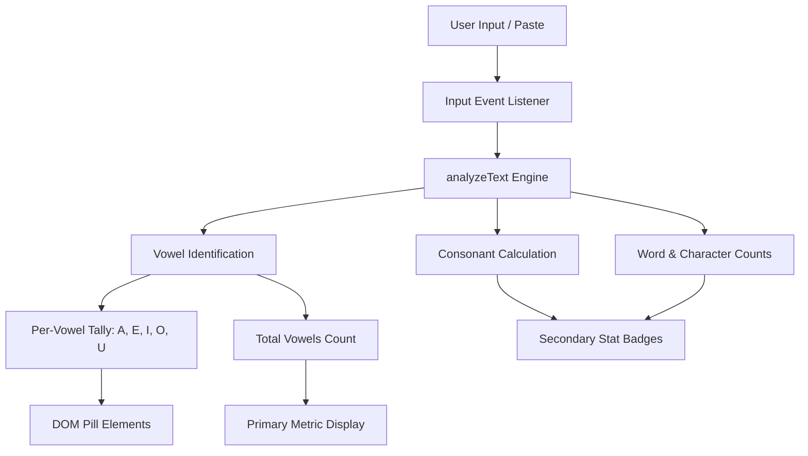

# Vowel Counter - Real-Time Linguistic Text Analyzer

[](https://developer.mozilla.org/en-US/docs/Web/HTML)
[](https://developer.mozilla.org/en-US/docs/Web/CSS)
[](https://developer.mozilla.org/en-US/docs/Web/JavaScript)
[](https://nodejs.org/)
[](https://opensource.org/licenses/MIT)

A modern, high-performance web utility for analyzing vowel distribution, consonant density, word counts, and character frequencies in real time. Built with clean, vanilla web technologies and styled with a glassmorphism interface.

---

## Overview

Vowel Counter provides instant textual diagnostics as users type or paste content. It computes cumulative vowel counts and isolates each individual vowel (A, E, I, O, U) alongside supplementary metrics including total characters, words, and consonants.

---

## Key Features

- **Real-Time Dynamic Analysis**: Computes metrics on every keystroke with zero noticeable latency.
- **Individual Vowel Breakdown**: Dedicated frequency counters for vowels A, E, I, O, and U.
- **Comprehensive Text Metrics**: Tracks total characters, words, and consonants simultaneously.
- **Quick-Fill Sample Text**: One-click preset insertion for immediate testing and demonstrations.
- **Result Clipboard Export**: Copy formatted diagnostic summaries directly to the clipboard.
- **Responsive Glassmorphic Design**: Tailored for both mobile touchscreens and high-resolution desktop displays.
- **Zero External Dependencies**: Pure HTML5, CSS3, and modern ECMAScript standard.

---

## Architecture & Data Flow



---

## Project Structure

```text
Vowel-Counter/
├── .gitignore          Standard Git exclusion patterns
├── index.html          Semantic markup and glassmorphic UI layout
├── README.md           Startup documentation and architecture overview
├── script.js           Core analysis logic, event handlers, and helpers
├── style.css           Responsive stylesheet, variables, and animations
└── tests/
    └── test_vowels.js  Unit test suite for text analysis algorithms
```

---

## Getting Started

### Prerequisites

- Any modern web browser (Google Chrome, Mozilla Firefox, Microsoft Edge, Safari)
- Optional: Node.js (version 16 or newer) for executing the automated unit test suite

### Running the Web Application

1. Clone the repository:

```bash
git clone https://github.com/Kumar44developer/Vowel-Counter.git
cd Vowel-Counter
```

2. Open the application directly in your browser:

Double-click `index.html` or open it with your browser:

```bash
start index.html
```

Or serve via an HTTP server:

```bash
npx serve .
```

---

## Automated Testing

The project includes an automated test suite verifying edge cases such as empty input, case-insensitivity, vowel-less strings, and pangrams.

Run the test suite using Node.js:

```bash
node tests/test_vowels.js
```

Expected output:

```text
Running Vowel Counter Unit Tests...

PASS: Empty text returns 0 vowels and 0 characters
PASS: Detects 3 vowels in 'hello world'
PASS: Breakdown counts 1 'e' and 2 'o'
PASS: Counts 7 consonants in 'hello world'
PASS: Counts 2 words in 'hello world'
PASS: Detects 10 vowels in uppercase and lowercase 'AEIOU aeiou'
PASS: Breakdown correctly identifies 2 'a' vowels
PASS: Correctly identifies 0 vowels in 'rhythm crypt 123 !@#'
PASS: Correctly counts 11 consonants
PASS: Pangram vowel count matches expected 11
PASS: Pangram word count matches 9

All 5 Vowel Counter unit tests passed successfully!
```

---

## Technical Specifications

| Component | Technology | Specification |
| :--- | :--- | :--- |
| Markup | HTML5 | Semantic container layout, ARIA-accessible cards |
| Styling | CSS3 | Flexbox, CSS Grid, custom properties, glassmorphism |
| Typography | Google Fonts | Outfit (400, 600, 700) |
| Runtime Logic | JavaScript (ES6+) | Event-driven architecture, regex parsing |
| Verification | Node.js | Native assert unit test harness |

---

## Browser Support

- Chrome: Version 90+
- Firefox: Version 88+
- Edge: Version 90+
- Safari: Version 14+
- Mobile Browsers: iOS Safari & Chrome for Android

---

## License

This project is licensed under the MIT License. Open source and available for personal and commercial use.
